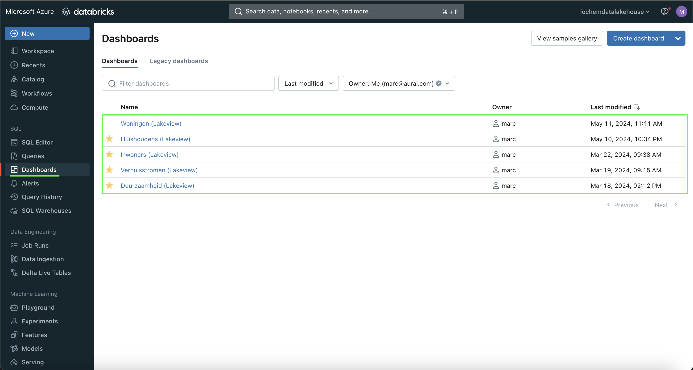
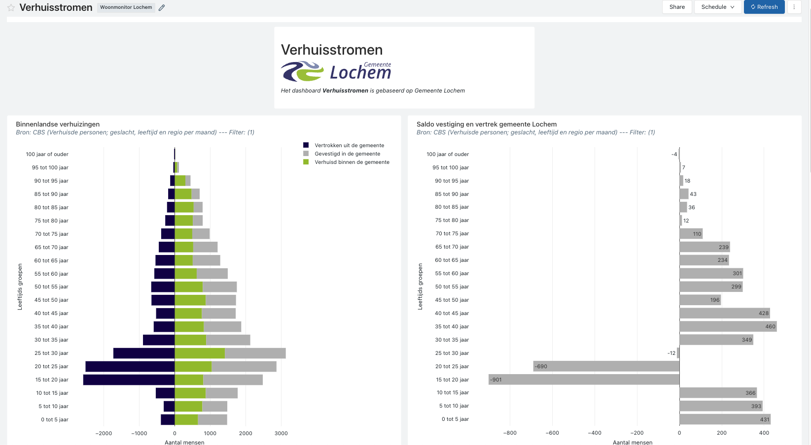
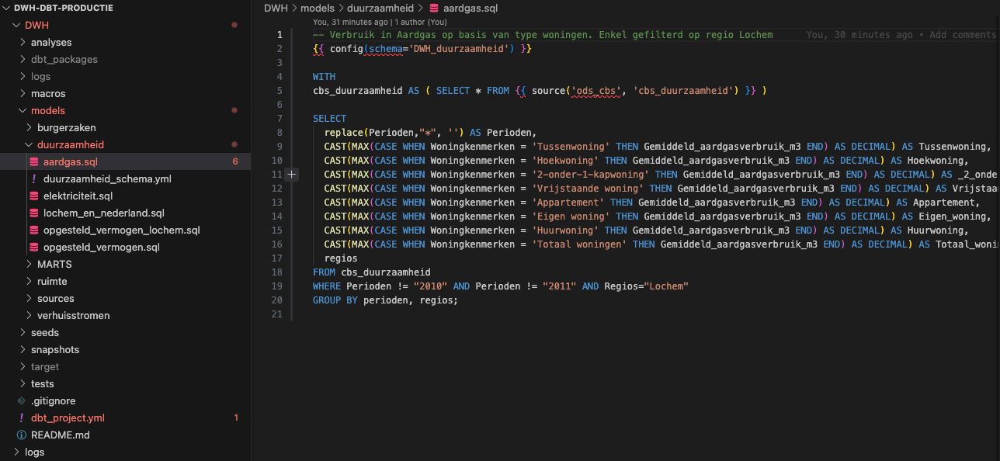

# Introductie: Project Woonmonitor
*Auteur: Marc Blomvliet - Aurai* 
Dit project is ontstaan vanwege een rapportageverplichting vanuit het Programma Woningbouw voor periode 2022-2030. Het is noodzakelijk om de afdeling *'Ruimte'* van Gemeente Lochem te voorzien van inzichten in de omvang, samenstelling en benutting van de woningvoorraad in de Gemeente Lochem.

# Databricks
Databricks is in basis gebruikt als Datalakehouse. Echter is er ook voor gekozen om rechstreeks de visualisaties(Dashboards) voor de woonmonitor in Databricks te implementeren. Het is natuurlijk ook mogelijk om dit in de toekomst te migreren naar PowerBI of Tableau (*indien dit een wens mocht zijn*), dit werkt prima in combinate met Databricks. 

Vanuit Azure Datafactory worden diverse notebooks in Databricks gebruikt in de pipelines, om vervolgens de databronnen te ingesten in het Datalakehouse van Gemeente Lochem. 
Deze notebooks zijn te vinden in Databricks onder *Workspace* -> *Repos* -> *dwh-processing* -> *Ingestie*.

Voorbeelden van databronnen die worden opgenomen:
- BRP
- BAG
- WOZ
- BRK 
- CBS

De schemas die in het Datalakehouse dan ontstaan:
- ods_basisregistraties
- ods_cbs

# Databricks Dashboards - Overview

In Databricks zijn alle Dashboards te vinden van de *Woonmonitor Lochem*, de woonmonitor is onderverdeeld in **5** verschillende dashboards. In de afbeelding hierboven is de gebruikers interface te zien van Databricks, links in het paneel is het mogelijk om via de knop **Dashboards** alle dashboards te bekijken (Indien je geautoriseerd bent).

- Huishoudens
- Verhuisstroom
- Duurzaamheid
- Woningen
- Inwoners

Zie hieronder een preview van hoe een dashboard eruit ziet in Databricks (*Dashboard: Verhuisstromen*):

# DBT

## Models en Views
Voor nu bestaan er **7** schemas: **dwh_burgerzaken** en **dwh_ruimte**. En in totaal **38** view models:
- **dwh_burgerzaken**
    - bevolkingsgroei
    - huishouden
    - huishoudtypes
    - inwoners
- **dwh_ruimte**
    - bag_num_recent
    - verblijfsobjecten
    - woningen_lochem
    - woningtypes_huishoudtypes
    - woz

> (Alle views die direct worden gebruikt in de dashboards *dash*)
- **dwh_dash_duurzaamheid**
    - aardgas
    - elektriciteit
    - lochem_en_nederland
    - opgesteld_vermogen
    - opgesteld_vermogen_lochem
- **dwh_dash_huishoudens**
    - huishoudtypes_per_woonplaats
    - woningtype_en_huishoudtype
- **dwh_dash_inwoners**
    - aantal_inwoners
    - aantal_woningen
    - bevolkingsgroei_lochem
    - bevolkingsgroei_per_jaar
    - bevolkingsgroei_per_maand
    - bevolkingsopbouw_brp
    - bevolkingsopbouw_leeftijd_geslacht
    - gemiddelde_leeftijd
    - thuiswonende_jongeren
    - totaal_inwoners_brp
- **dwh_dash_verhuisstromen**
    - gevestigd_2021
    - gevestigd_2022
    - verhuisd_2021
    - verhuisd_2022
    - verhuizingen
- **dwh_dash_woningen**
    - bouwtrend_5jaren
    - oppervlakte
    - woning_types
    - woningen_per_woonplaats
    - woningen_totaal
    - woz_waarde
    - woz_waarde_distributie

## Databricks connector
Alle DBT models staan in de GIT Repository *DWH-DBT* en vervolgens onder *models*.
Het is ook mogelijk om ipv DBT, direct in Databricks SQL querys (ipv. views) klaar te zetten voor Dashboards.

Om veranderingen aan te brengen in de views of om bijvoorbeeld nieuwe views of schemas te creëren, dien je de GIT repository
lokaal te clonen om te kunnen bewerken. Daarnaast is het noodzakelijk om DBT-core te hebben en de connectie met Databricks te hebben (Databricks connector).

**Opzetten van DBT Core:**  
Maak een virtual environment:
> python3 -m venv dbt_venv

Activeer je environment:
> source dbt_venv/bin/activate

Install dbt core met databricks-connector:
> pip3 install dbt-databricks

Verifieër:
> dbt --version
> dbt debug

Zorg ervoor dat je in je lokale User root folder een .dbt folder hebt aangemaakt met daarin de file: 
profiles.yml

Met als volgende er in:
- Lochem_DWH:
  - target: dev
  - outputs:
    - dev:
      - type: databricks
      - catalog: hive_metastore
      - schema: dwh
      - host: ****
      - http_path: /sql/1.0/warehouses/be7dfdd910e88b7d
      - token: **** 
      - threads: 1  

Voor host en token, vraag naar Marc (Aurai), of indien er vragen zijn om dit te configureren.
Het kan namelijk complex zijn, echter is dit maar eenmalig nodig om dit te configureren op je device.

# Azure Datafactory (ADF)
